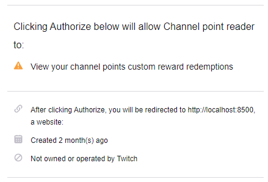

# Sound Trigger Channel Points

A Node.js app that will listen to Twitch channel points to play sound effects
or TTS (user input or announcer) in a hidden webpage (like a browser source in OBS).

This application is a derivative form of Sound Trigger Bot made by AlcaDesign (https://github.com/alcadesign/sound-trigger-bot).

## Do the things

### Register your application on Twitch developer portal

Visit [Twitch developer console](https://dev.twitch.tv/console/apps) and register your application. Put OAuth redirect URL according to the base url on `.env` (if you're hosting on local machine, use the given example on the file).

### Configure node and npm instance

```bash
# Run the starting script (make filter and tokens directory)
mkdir filter tokens
# Touch a file for regex and both access and refresh token
touch tokens/access tokens/refresh tokens/id filter/regex.txt
# Clone the repo
git clone git@github.com:daftmaple/sound-trigger-channel-points.git
# Change directory into the repo
cd sound-trigger-channel-points
# Copy the .env.example file to .env
cp .env.example .env
# Edit the .env file
nano .env
# Copy the points.json.example file to points.json
cp points.json.example points.json
# Edit the .env file according to the configuration
nano points.json
# Install the dependencies
npm install
# Start the server
npm start
```

By default, the port is set to `8080` in the `.env`. Go to `localhost:8080` and
you'll get a link to the sfx page. This is the page that would be loaded in OBS.
The main page may be used for adding more sound effects and other options later.

## Set up Sound Effects and TTS on Channel Points

### Setting up TTS

Set a channel point with a reward name called `TTS`, with require viewer to enter text. It is highly recommended for AutoMod to be allowed here, since review reward queue does not stop the channel point event to be emitted from the API. Most profanity is filtered by `filter/regex.txt`, where it takes both string and regex. It is advised for most TOS-forbidden words to be filtered directly via blocked terms.

I did not include the `filter/regex.txt` in this repository.

### Setting up sound effects

Set a channel point with a reward name called `Soundboard: <sound name>`, without requiring viewer to enter text.

### Enable application to read your channel custom reward redemptions

Note: this application only asks for `channel:read:redemptions`, where it can only read redemptions in your channel. This application **will not ask for any other scope**, especially sensitive information such as email or moderation.



### Channel Points Redeemables

If you want to announce channel points redeemables as TTS, list all redeemables title as an array of string in `points.json` under `points["redemptions"]["redeemables"]`.

### Channel Points Prefix

By default, the TTS command is called `TTS` and soundboard starts with `Soundboard: `. To modify this, change the configuration on `points.json`, under `points["tts"]["prefix"]` or `points["sound"]["prefix"]`.

### TTS voice

By default, the user voice is Brian. Put the desired voice(s) as an array of string under `["voice"]` on either TTS or redeemables.

### Sound Effects

Sound effects are sounds files located in `www/sound-effects/` and listed in the  `config.toml` file. To add more sound effects, add the file in the sounds directory and the config file.
